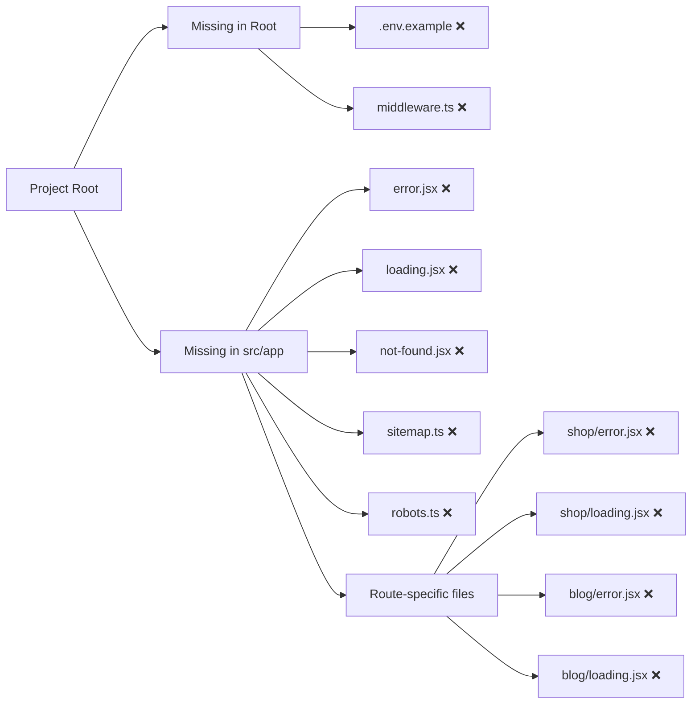
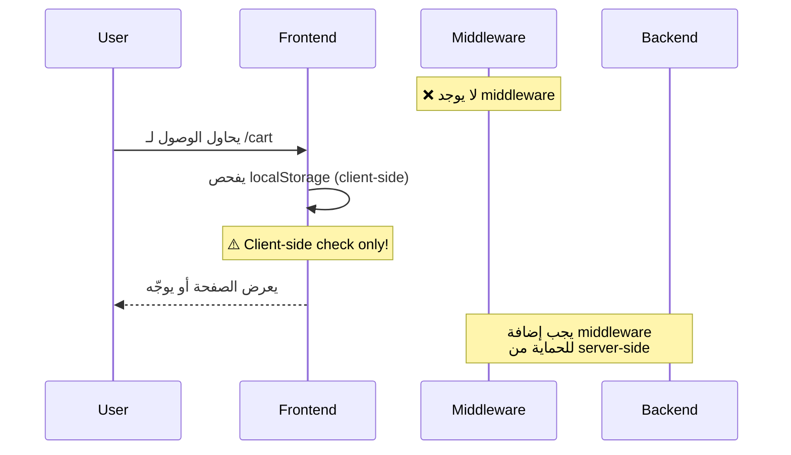
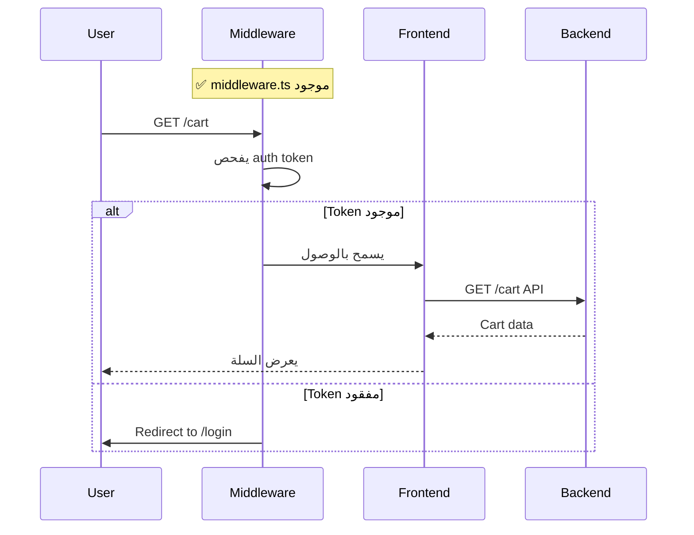
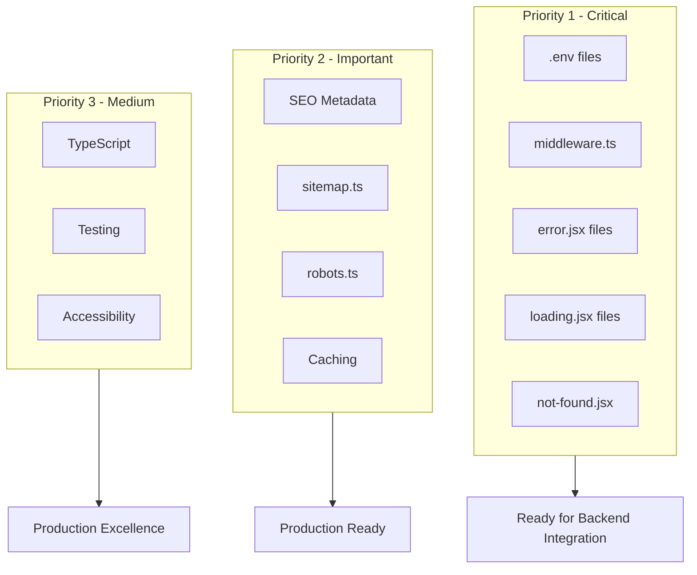

# Frontend Issues - Visual Summary

## 🎯 النواقص الحرجة

```mermaid
graph TD
    Frontend[Frontend Magic Show]
    
    Frontend --> Critical[Critical Issues 🔴]
    Frontend --> Important[Important Issues ⚠️]
    Frontend --> Medium[Medium Priority 📝]
    
    Critical --> EnvFile[".env.example ❌"]
    Critical --> Middleware["middleware.ts ❌"]
    Critical --> ErrorPages["error.jsx files ❌"]
    Critical --> LoadingPages["loading.jsx files ❌"]
    Critical --> NotFound["not-found.jsx ❌"]
    Critical --> ConsoleLog["console.log في الكود ⚠️"]
    Critical --> CORS["CORS محدود ⚠️"]
    
    Important --> SEO["SEO - Metadata API ⚠️"]
    Important --> Sitemap["sitemap.xml ❌"]
    Important --> Robots["robots.txt ❌"]
    Important --> Caching["Caching Strategy ⚠️"]
    Important --> Images["Image Optimization ⚠️"]
    
    Medium --> TypeScript["TypeScript Migration 📝"]
    Medium --> Testing["Testing مفقود ❌"]
    Medium --> PropTypes["PropTypes ❌"]
    Medium --> A11y["Accessibility محدود ⚠️"]
```



---

## 📊 Missing Files Overview



---

## 🔄 Current State vs Required State

### Authentication Flow



### Recommended Flow



---

## 📁 File Structure - Current vs Ideal

### Current Structure (الحالية) ❌

```
src/app/
├── layout.jsx ✅
├── page.jsx ✅
├── error.jsx ❌ مفقود
├── loading.jsx ❌ مفقود
├── not-found.jsx ❌ مفقود
├── sitemap.ts ❌ مفقود
├── robots.ts ❌ مفقود
└── shop/
    ├── page.jsx ✅
    ├── error.jsx ❌ مفقود
    └── loading.jsx ❌ مفقود

Root/
├── middleware.ts ❌ مفقود
├── .env.example ❌ مفقود
└── .env.local ❌ مفقود
```

### Ideal Structure (المطلوبة) ✅

```
src/app/
├── layout.jsx ✅
├── page.jsx ✅
├── error.jsx ✅ إضافة
├── loading.jsx ✅ إضافة
├── not-found.jsx ✅ إضافة
├── sitemap.ts ✅ إضافة
├── robots.ts ✅ إضافة
└── shop/
    ├── page.jsx ✅
    ├── error.jsx ✅ إضافة
    └── loading.jsx ✅ إضافة

Root/
├── middleware.ts ✅ إضافة
├── .env.example ✅ إضافة
└── .env.local ✅ إضافة
```

---

## 🎯 Priority Matrix



---

## 📊 Statistics

### Files Missing

- **Critical files:** 5 ملفات
- **Per-route files:** ~8 ملفات (error.jsx, loading.jsx لكل route)
- **Configuration files:** 3 ملفات (.env, middleware, etc.)

**Total missing:** ~16 ملف

### Code Issues

- **Console statements:** 6 مواضع
- **Hard-coded values:** عدة مواضع
- **Missing types:** ~115 ملف بدون types

---

## ⏱️ Time Estimates

| Priority | Items | Time Needed |
|----------|-------|-------------|
| 🔴 Critical | 7 items | 2-3 أيام |
| ⚠️ Important | 5 items | 1 أسبوع |
| 📝 Medium | 4 items | 2-3 أسابيع |
| 💡 Nice to Have | 4 items | 1-2 أسابيع |

**Total for Critical:** 2-3 أيام فقط!

---

## 🚀 Next Action

### ابدأ الآن:

1. أنشئ `.env.example` و `.env.local`
2. أنشئ `middleware.ts`
3. أنشئ `src/app/error.jsx`
4. أنشئ `src/app/loading.jsx`
5. أنشئ `src/app/not-found.jsx`
6. أزل console.log statements
7. حدّث `next.config.ts` للـ CORS

**بعد هذه الإصلاحات، المشروع جاهز للربط مع الـ Backend! ✅**

---

**For full details:** راجع `FRONTEND_REVIEW_REPORT.md`
